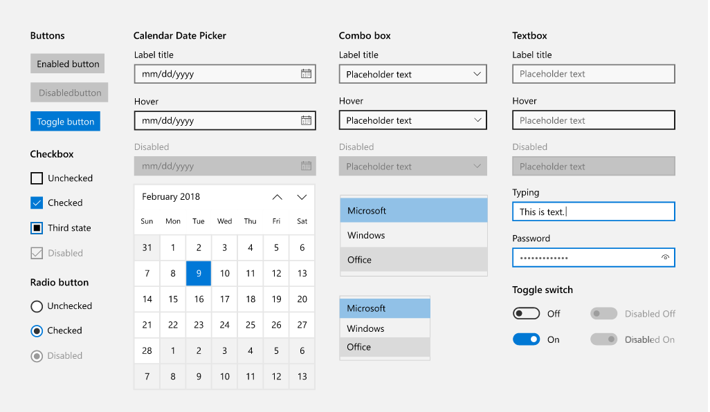

## uwp-ui-react

Uwp-ui-react is a react web ui libruary that implements [Microsoft's uwp-design](https://docs.microsoft.com/en-us/windows/uwp/design/basics/).

[Read the docs.](https://alphago88.github.io/uwp-ui-react/)



## Table of Contents
- [Quickstart](#quickstart)
- [Supported Browsers](#supported-browsers)
- [Copyright and license](#copyright-and-license)

## Quickstart
Installation:
```js
$ npm install --save uwp-ui-react
```

usage:
```js
import React form 'react';
import ReactDOM from 'react-dom';
import { Button } from 'uwp-ui-react';

import 'uwp-ui-react/lib/uwp-ui-react.css';  // You probably need webpack here.

function App() {
	return (
		<Button>My Button</Button>
	);
}

ReactDOM.render(<App/>, document.getElementById('app'));
```

## Supported Browsers:
- Chrome >= 45
- Firefox >= 38
- Edge >= 12
- IE >= 10
- iOS >= 9
- Safari >= 9
- Android >= 4.4
- Opera >= 30

## Copyright and license
uwp-ui-react is under the MIT license.
